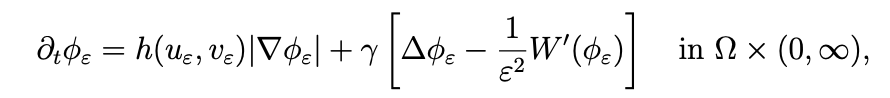

# Trajecta

Trajecta is a Python-driven visualizer for cell movement and development, collating several studies to create a finished project.

# Logbook
## Day 1
Once I decided on the project details, I had to decide how to make this thing work.
So, I went on the hunt for research papers I could rely on for this. 
For cell movement, I found _Predicting the future direction of cell movement with convolutional neural networks_ by Shori Nishimoto et al. (2019), which used AI to predict the direction of the movement of the cell in the future. However, the AI needed a real picture of the cell along with the shape of the cell in the picture, so I needed something to 1. Generate valid cell shapes, 2. Figure out the next shape that would come in the sequence, 3. Some kind of software to interpolate smoothly in between those shapes so I can reduce compute.

After some time, I had eventually found this paper: _Cell Polarity and Movement with Reaction-Diffusion and Moving Boundary: Rigorous Modeling and Robust Simulations_ by Shuang Lui et al. (2022).

However, I'm not an expert so I can't understand these gargantuan behemoths:

So I got a LONG way to go.
## Day 2 & 3
Looking at the first paper, I realized many issues that could arise with this. First, I need to figure out how to make my cells that are visualized on your screen 1. Aesthetically pleasing, and 2. still work with the AI's parameters because the AI usually recieves REAL cell pictures. Also, the paper states something about a "halo" above the cell that improves the accuracy of the prediction.
However, looking at many different papers, they said that not having the halo improves the accuracy. Give convenience, I decided to not have the halo in my program because that is just an unnecessary hassle.

Looking at the second paper, I decided I needed to know how cells even move to understand what the researchers even meant.
After watching a video from Khan Academy about cell movement, I realized that most human cell movement comes from signals in our bodies that tell the cell to create a leading edge and rear using microtubules that form and actin filaments. However, to predict individual cell movements without having those mechanisms, especially without the cells being WITHIN a body, would require me to use some other type of cell, like amoeba, that can move freely.

# References (Will alphabetize later)
Nishimoto, S., Tokuoka, Y., Yamada, T. G., Hiroi, N. F., & Funahashi, A. (2019). Predicting the future direction of cell movement with convolutional neural networks. PloS one, 14(9), e0221245. https://doi.org/10.1371/journal.pone.0221245

Liu, S., Cheng, L. T., & Li, B. (2022). Cell Polarity and Movement with Reaction-Diffusion and Moving Boundary: Rigorous Modeling and Robust Simulations. arXiv preprint arXiv:2208.05536.
